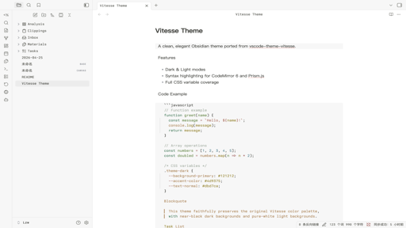

# Vitesse — Obsidian Theme

> A clean, elegant Obsidian theme ported from [vscode-theme-vitesse](https://github.com/antfu/vscode-theme-vitesse) by [Anthony Fu](https://github.com/antfu).

## Features

- **Dark & Light modes** — both fully supported
- **Syntax highlighting** — faithful to the original Vitesse palette, covering CodeMirror 6 (Live Preview / Source mode) and Prism.js (Reading view)
- **Full CSS variable coverage** — headings, links, tags, tables, blockquotes, callouts, graph view, and more
- **Minimal & distraction-free** — near-black dark background (`#121212`), pure-white light background (`#ffffff`)

## Color Palette

| Role | Dark | Light |
|------|------|-------|
| Background | `#121212` | `#ffffff` |
| Secondary BG | `#181818` | `#f7f7f7` |
| Foreground | `#dbd7ca` | `#393a34` |
| Accent (green) | `#4d9375` | `#1c6b48` |
| String | `#c98a7d` | `#b56959` |
| Keyword | `#4d9375` | `#1e754f` |
| Function | `#80a665` | `#59873a` |
| Number | `#4c9a91` | `#2f798a` |
| Type | `#5da994` | `#2e8f82` |
| Comment | `#758575` | `#a0ada0` |

## Installation

### From Obsidian (recommended)

1. Open **Settings → Appearance → Themes**
2. Click **Manage**
3. Search for `Vitesse`
4. Click **Install and use**

### Manual

1. Download `theme.css` and `manifest.json` from this repository
2. Copy them into `<your-vault>/.obsidian/themes/Vitesse/`
3. Open **Settings → Appearance** and select **Vitesse**

## Credits

This theme is a port of **[vscode-theme-vitesse](https://github.com/antfu/vscode-theme-vitesse)** by [Anthony Fu](https://github.com/antfu), which itself is based on [github-vscode-theme](https://github.com/primer/github-vscode-theme) by Primer.

All color decisions, design language, and token mappings originate from the original VS Code theme.

## License

MIT — see [LICENSE](LICENSE)

Original vscode-theme-vitesse: MIT © [Anthony Fu](https://github.com/antfu)
